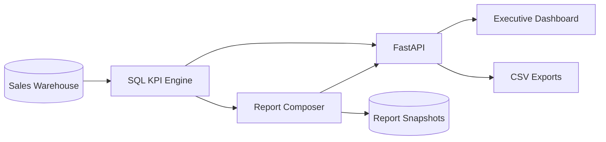

# Architecture

```mermaid
flowchart LR
    W[(Sales Warehouse)] --> K[SQL KPI Engine]
    K --> R[Report Composer]
    K --> API[FastAPI]
    R --> API
    API --> UI[Executive Dashboard]
    API --> CSV[CSV Exports]
    R --> S[(Report Snapshots)]
```

Metric definitions live in the analytics layer rather than templates. That keeps revenue/margin/customer logic consistent across API endpoints, reports and exports.
